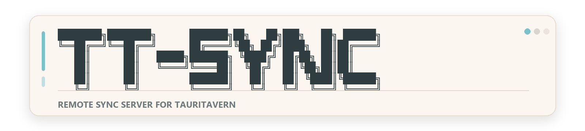
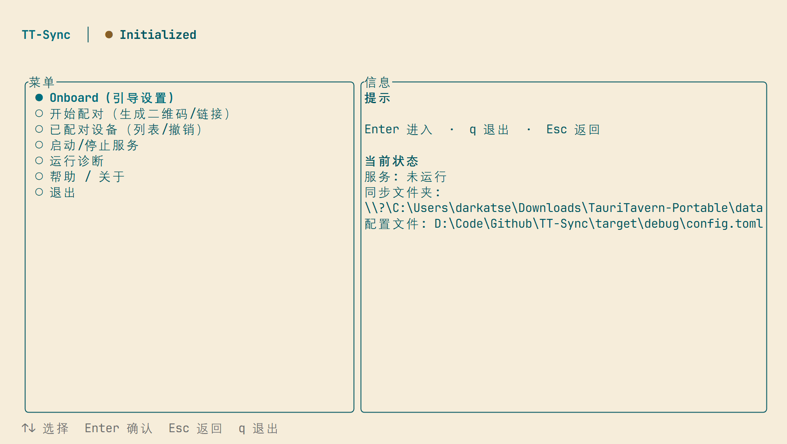

<p align="center">
  
  
  
</p>

<p align="center">
  
</p>

<p align="center">
  <strong>Remote Synchronization Server for TauriTavern</strong><br/>
  <em>I wanna give my characters a bigger home!</em>
</p>

<p align="center">
  
</p>

<p align="center">
  <a href="./README.md">中文</a>
</p>

---

## Why TT-Sync?

Ever found yourself:
- Wanting to sync TauriTavern data between home and a VPS, but LAN Sync only works on the local network?
- Wanting a NAS to act as the canonical copy you can pull from anywhere?
- Wanting to sync with vanilla SillyTavern too?

**TT-Sync** is a standalone remote sync server for exactly that problem: it takes the sync endpoint out of the LAN and onto a VPS, NAS, or home server without giving up control or security.

Built with **Rust** 🦀, TT-Sync provides:
- **End-to-end transport trust**: TLS 1.3 with SPKI pinning, no public CA required
- **Single-binary deployment**: suitable for VPS, NAS, containers, and home servers
- **Ed25519 device identity**: every paired device is cryptographically verified
- **Bidirectional compatibility**: works with both TauriTavern and vanilla SillyTavern

---

## Installation

### One-Line Install

Copy, paste, and let the little sync goblin do the rest:

```bash
curl -fsSL https://raw.githubusercontent.com/Darkatse/TT-Sync/main/scripts/install.sh | sh
```

Windows PowerShell:

```powershell
iex ((iwr https://raw.githubusercontent.com/Darkatse/TT-Sync/main/scripts/install.ps1).Content)
```

The installer prefers the latest stable release. If you show up before the stable one exists, it quietly grabs `nightly` instead. 

### Download a Binary

Download a prebuilt binary from [Releases](https://github.com/Darkatse/TT-Sync/releases) and put it somewhere in your `$PATH`.

For VPS, NAS, and container deployment, see [Docker Guide](./docs/Docker.md).

### Build from Source

```bash
git clone https://github.com/Darkatse/TT-Sync.git
cd TT-Sync
cargo build --release
```

The build output is:

```bash
target/release/tt-sync
```

On Windows, use `tt-sync.exe`.

---

## For The Tinkerers

If you want the nightly build, a pinned version, or your own carefully curated install directory, here is the slightly nerdier menu:

Nightly:

```bash
curl -fsSL https://raw.githubusercontent.com/Darkatse/TT-Sync/main/scripts/install.sh | sh -s -- --nightly
```

```powershell
& ([scriptblock]::Create((iwr https://raw.githubusercontent.com/Darkatse/TT-Sync/main/scripts/install.ps1).Content)) -Nightly
```

Pin a version:

```bash
curl -fsSL https://raw.githubusercontent.com/Darkatse/TT-Sync/main/scripts/install.sh | sh -s -- --version 0.1.0
```

```powershell
& ([scriptblock]::Create((iwr https://raw.githubusercontent.com/Darkatse/TT-Sync/main/scripts/install.ps1).Content)) -Version 0.1.0
```

Choose your own install directory:

```bash
curl -fsSL https://raw.githubusercontent.com/Darkatse/TT-Sync/main/scripts/install.sh | sh -s -- --dir "$HOME/.local/bin"
```

```powershell
& ([scriptblock]::Create((iwr https://raw.githubusercontent.com/Darkatse/TT-Sync/main/scripts/install.ps1).Content)) -InstallDir "$HOME\\bin"
```

Default install paths:
- Linux / macOS: writable `/usr/local/bin` when possible, otherwise `~/.local/bin`
- Windows: `%LocalAppData%\TT-Sync\bin`, and the script adds it to the user `PATH`

---

## Recommended Usage: TUI

### First-Time Setup

For first deployment, start with:

```bash
tt-sync onboard
```

The guided flow walks you through:
- selecting language
- setting the listen port and `Public URL`
- choosing the `layout mode`
- choosing the server data folder
- optionally pairing right away
- choosing how the server should run: foreground or user-scope service

Supported user-scope service managers:
- Linux: `systemd --user`
- macOS: `LaunchAgent`
- Windows: `Task Scheduler` (beta)

### Day-to-Day Operation

After initialization, the normal entrypoint is:

```bash
tt-sync
```

The main menu currently covers:
- `Onboard`: rerun guided setup
- `Pair`: generate a QR code / pairing link and wait for TauriTavern
- `Peers`: inspect, rename, edit permissions, and revoke paired devices
- `Serve`: start/stop the foreground server or manage the user-scope service
- `Doctor`: validate config, certificates, workspace, and pairing state
- `Help`: show key bindings and deployment tips

### Basic Keys

- `↑ ↓`: move focus
- `Enter`: confirm
- `Esc`: go back
- `q`: quit

On the pairing screen:
- `r`: refresh the QR code / regenerate the pairing token

### Pairing Flow

The intended path is simple:
1. Run `tt-sync onboard` on the server for first-time setup, or open `Pair` from the `tt-sync` main menu.
2. Generate a QR code or pairing link.
3. In TauriTavern, scan the QR code or paste the `tauritavern://tt-sync/pair?...` link.
4. Manage permissions in `Peers` and runtime status in `Serve`.

---

## Layout Mode

TT-Sync v2 uses a fixed **full sync dataset**. What you choose in practice is how the canonical wire paths map onto the server's local folder layout.

| Option | Intended target | Global extensions mapping |
|--------|------------------|--------------------------|
| `tauritavern` | TauriTavern `data/` | `extensions/third-party` → `data/extensions/third-party` |
| `sillytavern` | SillyTavern repo layout | `extensions/third-party` → `public/scripts/extensions/third-party` |
| `sillytavern-docker` | SillyTavern Docker volume layout | `extensions/third-party` → `./extensions` |

Use:
- `tauritavern` for a TauriTavern data directory
- `sillytavern` for a regular SillyTavern repository
- `sillytavern-docker` for Docker volume mounts

---

## Security Model

```
┌──────────────────────────────────────────────────────────┐
│  Layer 1: Transport Security                             │
│  TLS 1.3 (self-signed) + SPKI pinning                    │
│  → The client pins the server public key during pairing  │
├──────────────────────────────────────────────────────────┤
│  Layer 2: Device Identity                                │
│  Ed25519 per-device keys + canonical request signing     │
│  → Short-lived session tokens are issued after verify    │
├──────────────────────────────────────────────────────────┤
│  Layer 3: Authorization                                  │
│  Per-device ACL: read / write / mirror-delete            │
│  Fixed allowlist restricts visible sync paths            │
└──────────────────────────────────────────────────────────┘
```

---

## Developer Docs

The README now keeps only the shortest user path. For lower-level commands, automation, and architecture details, see:

- [Docker Guide](./docs/Docker.md)
- [CLI Reference](./docs/CLI.md)
- [Architecture](./docs/Architecture.md)
- [Current State](./docs/CurrentState.md)
- [Upstream Contract](./docs/UpstreamContract.md)
- [Tech Stack](./docs/TechStack.md)

---

## Contributing

Found a bug? Want a feature? PRs welcome!

```bash
cargo test
cargo build --release
```

---

## License

MIT License — sync freely, just don't blame us if your waifu disappears.

---

<p align="center">
  <em>Made with ❤️ for the TauriTavern community.</em><br/>
  <strong>Happy syncing!</strong>
</p>
