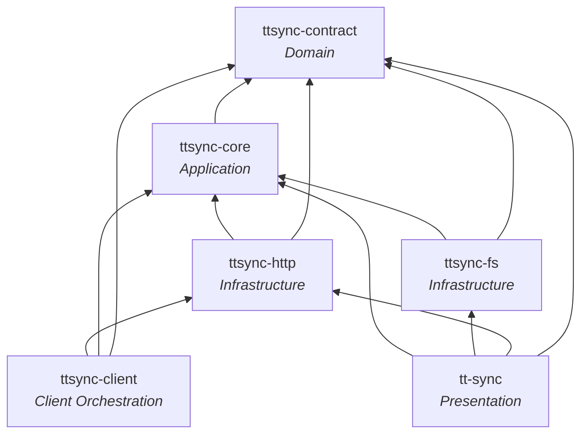
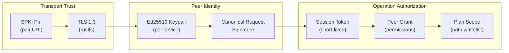
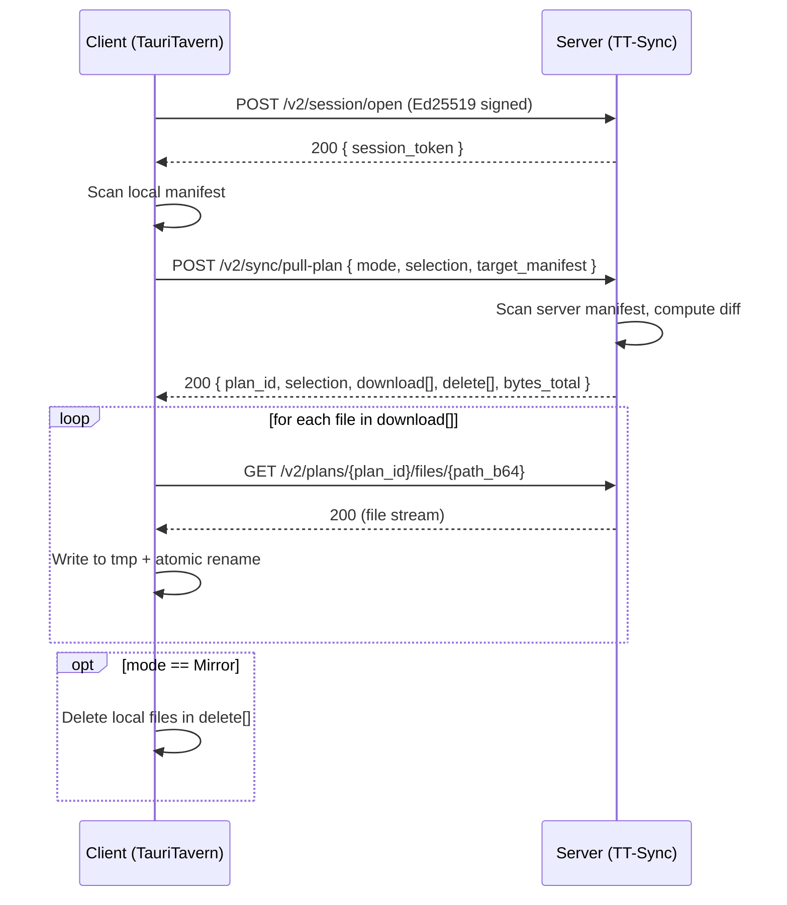
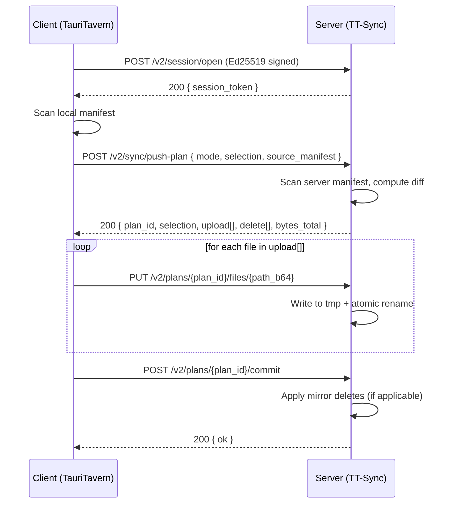

# TT-Sync — System Architecture

## 1. Architectural Style

TT-Sync follows **Clean Architecture** with an explicit dependency rule: inner layers define abstractions, outer layers provide implementations. No inner layer knows about any outer layer.

```
┌──────────────────────────────────────────────────────────┐
│                     tt-sync                              │  Presentation
│              (clap commands, progress UI)                │
├──────────────────────────┬───────────────────────────────┤
│                   ttsync-client                          │  Client orchestration
│        (pull/push engine, progress, local apply)          │  (Outer use case)
├──────────────────────────┬───────────────────────────────┤
│       ttsync-http        │        ttsync-fs              │  Infrastructure
│  (axum server, reqwest   │  (manifest scanner,           │  (Adapters)
│   client, TLS setup)     │   atomic file I/O)            │
├──────────────────────────┴───────────────────────────────┤
│                     ttsync-core                          │  Application
│         (use cases, orchestration, traits)               │  (Use Cases)
├──────────────────────────────────────────────────────────┤
│                   ttsync-contract                        │  Domain
│       (protocol types, wire format, invariants)          │  (Entities)
└──────────────────────────────────────────────────────────┘
```

### Dependency Rule



Arrows point toward dependencies. Every crate may depend on layers below it, never above.

## 2. Crate Responsibilities

### 2.1 `ttsync-contract` (Domain Layer)

**Zero business logic. Only types, invariants, and protocol definitions.**

This crate is the shared language between TT-Sync and TauriTavern. It must be usable as a dependency in both projects without pulling in any runtime, framework, or I/O dependency.

#### Key Types

| Type | Purpose |
|------|---------|
| `SyncPath` | Newtype over `String`. Validated at construction: UTF-8, forward-slash separated, no `..`, no leading `/`, no backslash. Once constructed, always valid. |
| `DeviceId` | Newtype `String`. UUID format. |
| `SyncMode` | Enum: `Incremental`, `Mirror`. |
| `OverwritePolicy` | Per-operation enum: `Exact` (default) or `PreferNewer`; owned by the logical sync initiator. |
| `ManifestEntryV2` | `{ path: SyncPath, size_bytes: u64, modified_ms: u64, content_hash: Option<String> }` |
| `ManifestV2` | `{ entries: Vec<ManifestEntryV2> }` |
| `PlanId` | Newtype `String`. Server-generated, opaque to clients. |
| `SessionToken` | Newtype `String`. Short-lived bearer token. |
| `PeerGrant` | `{ device_id: DeviceId, device_name: String, public_key: Vec<u8>, permissions: Permissions, paired_at_ms: u64, last_sync_ms: Option<u64> }` |
| `Permissions` | `{ read: bool, write: bool, mirror_delete: bool }` |
| `SyncPhase` | Enum: `Scanning`, `Diffing`, `Downloading`, `Uploading`, `Deleting`. |
| `PairUri` | Structured pair URI builder/parser: `tauritavern://tt-sync/pair?v=2&url=...&token=...&exp=...&spki=...` |
| `CanonicalRequest` | Builder for the v2 canonical signature format. |
| `DatasetSelection` | Wire-level selected dataset ids + policy version. Plan requests must include it explicitly; missing selection is rejected. |

`PullPlanRequest` and `PushPlanRequest` carry `overwrite_policy`. The field is
optional on the wire and defaults to `Exact`, so existing v2 clients retain
their previous source-authoritative behavior. A client selecting
`PreferNewer` requires the peer to advertise `overwrite_policy_v1` before it
opens a session or scans its workspace.

#### Design Rules

- All constructors enforce invariants. Invalid states are unrepresentable.
- `serde::Serialize` + `Deserialize` for wire compatibility.
- No `tokio`, no `std::fs`, no I/O. Only `serde`, `base64`, `thiserror`.

### 2.2 `ttsync-core` (Application Layer)

**Use-case orchestration. Defines traits for all external dependencies.**

This crate contains the protocol rules and storage ports. Executable client transfer orchestration lives in `ttsync-client`, keeping stream/compression dependencies out of core.

#### Traits (Ports)

```rust
/// Reads and writes the file manifest for the v2 dataset.
pub trait ManifestStore: Send + Sync {
    async fn scan(&self, policy: ResolvedDatasetPolicy) -> Result<ManifestV2, SyncError>;
    async fn read_file(&self, path: &SyncPath) -> Result<Box<dyn AsyncRead + Send>, SyncError>;
    async fn write_file(&self, path: &SyncPath, data: &mut (dyn AsyncRead + Send + Unpin), modified_ms: u64) -> Result<(), SyncError>;
    async fn delete_file(&self, path: &SyncPath) -> Result<(), SyncError>;
}

/// Manages paired peer grants and sessions.
pub trait PeerStore: Send + Sync {
    async fn get_peer(&self, device_id: &DeviceId) -> Result<PeerGrant, SyncError>;
    async fn save_peer(&self, grant: PeerGrant) -> Result<(), SyncError>;
    async fn remove_peer(&self, device_id: &DeviceId) -> Result<(), SyncError>;
    async fn list_peers(&self) -> Result<Vec<PeerGrant>, SyncError>;
}
```

#### Use-Case Modules

| Module | Responsibility |
|--------|---------------|
| `pairing` | Generate pairing tokens, validate incoming pair requests, register peer grants. |
| `session` | Open/validate sessions: verify Ed25519 signatures, enforce time window, track nonces. |
| `plan` | Compute pull-plan and push-plan diffs given source and target manifests. |
| `bundle` | Shared bundle framing helpers and capability constants. |
| `dataset` | Versioned DatasetPolicy split into catalog, public profiles, path exclusions, runtime eligibility helpers, and `prune_boundary_for_path()` for scope-aware delete boundaries. |

#### Error Type

```rust
pub enum SyncError {
    NotFound(String),
    InvalidData(String),
    Unauthorized(String),
    Io(String),
    Internal(String),
}
```

Intentionally simple. Maps cleanly to HTTP status codes at the adapter boundary.

### 2.3 `ttsync-fs` (Infrastructure — File System Adapter)

**Implements `ManifestStore` against the real file system.**

| Component | Responsibility |
|-----------|---------------|
| `FsManifestStore` | Walks the workspace per dataset scope. Produces `ManifestV2`. |
| DatasetPolicy scanning | Walks policy scan roots and filters candidate files through the selected dataset predicates. |
| Runtime eligibility | Keeps active TauriTavern Agent runs out of manifests until their run status is terminal. |
| Atomic write | Write to `{name}.{ext}.ttsync.tmp` → `rename` to final path. Same pattern as current LAN Sync. |
| Mirror delete | Deletes each planned file, then removes fileless ancestor trees without crossing the owning dataset boundary. Links and all other non-directory nodes stop pruning. |
| mtime preservation | Uses `filetime` to set modification time after write. |
| Path mapping | Translates `SyncPath` (wire format, always `/`-separated) to platform-native `PathBuf`. |
| Layout mapping | Maps canonical wire paths to derived mount points (`LayoutMode` + `WorkspaceMounts`). Mapping stays inside this adapter — never leaks to wire protocol. |

### 2.4 `ttsync-http` (Infrastructure — HTTP Adapter)

**Implements the v2 HTTP protocol: server routes (axum) and client calls (reqwest).**

#### Server (`server` module)

Routes:

| Method | Path | Purpose |
|--------|------|---------|
| `GET` | `/v2/status` | Health check. Returns server identity and capabilities. |
| `POST` | `/v2/pair/complete` | Consume one-time token, register peer. |
| `POST` | `/v2/session/open` | Ed25519-signed session open. Returns `SessionToken`. |
| `POST` | `/v2/sync/pull-plan` | Compute pull diff. Returns `PlanId` + file list. |
| `POST` | `/v2/sync/push-plan` | Compute push diff. Returns `PlanId` + file list. |
| `GET` | `/v2/plans/{plan_id}/files/{path_b64}` | Download file (plan-scoped). |
| `PUT` | `/v2/plans/{plan_id}/files/{path_b64}` | Upload file (plan-scoped). |
| `GET` | `/v2/plans/{plan_id}/bundle` | Download a plan-scoped transfer bundle. |
| `PUT` | `/v2/plans/{plan_id}/bundle` | Upload a plan-scoped transfer bundle. |
| `POST` | `/v2/plans/{plan_id}/commit` | Finalize push: apply deletions. |

Shared middleware:
- **Session auth extractor** — validates `SessionToken` from `Authorization: Bearer` header.
- **Plan-scope guard** — ensures requested path exists in the active plan.
- **Dataset-scope guard** — plan requests validate both manifests against the selected DatasetPolicy before any transfer/delete is recorded.
- **Dataset capability report** — `/v2/status` exposes public leaf dataset ids separately from public profile ids.

#### TLS (`tls` module)

| Component | Responsibility |
|-----------|---------------|
| `SelfManagedTls` | Loads or generates long-term TLS private key + self-signed cert via `rcgen`. Computes `spki_sha256`. Configures `rustls::ServerConfig`. |
| `TlsMode` trait | Abstraction point for future `ProvidedCert` / `BehindProxy` modes. MVP only implements `SelfManagedTls`. |

#### Client (`client` module)

| Component | Responsibility |
|-----------|---------------|
| `SyncClient` | High-level client: open session, request plan, download/upload files, commit. Uses `reqwest`. |
| SPKI pinning verifier | Custom `ServerCertVerifier` that validates the server's SPKI hash against the pinned value from pairing, ignoring hostname/issuer/expiry. |

### 2.5 `ttsync-client` (Client Orchestration)

**Reusable client-side sync engine for TauriTavern and other native clients.**

This crate owns the client workflow that is too concrete for `ttsync-core` and too reusable to live in a Tauri command handler:

| Component | Responsibility |
|-----------|---------------|
| `ClientSyncEngine` | Pull and direct-push sequence: status capability check → session open → permission check → local scan → plan request → plan scope validation → transfer → mirror delete/commit. |
| `ClientWorkspace` | Local workspace port with scan/read/write/delete. Native clients implement it directly so failed writes/deletes can report whether local state changed. |
| `SyncObserver` | Minimal progress callback. Tauri, CLI, and tests map it to their own event systems. |
| Bundle transfer | Uses `bundle_v1` + `zstd_v1` when advertised, otherwise falls back to per-file endpoints. |

`ttsync-client` intentionally depends on `ttsync-http::client::SyncClient` directly. There is only one transport today, so a transport trait would add ceremony without reducing coupling. The crate stays free of Tauri, AppState, window events, and configuration storage.

### 2.6 `tt-sync` (Presentation Layer)

**Thin shell. No business logic.**

| Subcommand | Delegates to |
|------------|-------------|
| `init` | Interactive prompts → writes `config.toml` via core/fs. Generates crypto identity. |
| `serve` | Configures TLS → starts axum server → prints startup banner → blocks. |
| `pair open` | Generates token via core → prints pair URI / QR / permissions. |
| `peers list` | Reads peer store → formats table. |
| `peers revoke` | Removes peer via core. |
| `doctor` | Validates config, TLS cert, and workspace/mount derivation. |
| `cert show` | Displays SPKI fingerprint, cert expiry, key info. |
| `cert rotate-leaf` | Re-signs cert with same key (preserves SPKI pin). |

When `tt-sync` consumes `ttsync-client`, it maps `SyncObserver` progress to terminal UI and tracing.

## 3. Security Architecture



### Layer Responsibilities

| Layer | Protects Against | Mechanism |
|-------|-----------------|-----------|
| **Transport Trust** | Eavesdropping, MITM, server impersonation | TLS 1.3 with SPKI pinning (no reliance on hostname or CA chain) |
| **Peer Identity** | Unauthorized devices | Ed25519 signature on session-open request (device_id + timestamp + nonce) |
| **Operation Authorization** | Privilege escalation, unauthorized file access | Session token scoped to peer grant; file access restricted to active plan paths |

### Canonical Request Format (v2)

```
TT-SYNC-V2
<device-id>
<timestamp-ms>
<nonce>
<method>
<path-and-query>
<body-sha256-base64url>
```

Signed with the device's Ed25519 private key. Server verifies against the registered public key, enforces ±90s time window, and maintains an LRU nonce set for replay prevention.

## 4. Data Flow

### Pull Sequence



### Push Sequence



## 5. State Management

### Configuration And State Locations

Default layout:

```
<exe-dir>/
└── config.toml           # User-editable configuration

<state-dir>/
├── identity.json         # Ed25519 keypair + device_id
├── tls/
│   ├── key.pem           # Long-term TLS private key
│   └── cert.pem          # Self-signed leaf certificate
├── peers.json            # Registered peer grants
└── sessions/             # Active session tokens (in-memory only, not persisted)
```

CLI-only headless deployments may override the config path with `--config-file <path>`, for example to place the config under the state volume in Docker. TUI entrypoints continue to use the default config path next to the executable.

The state directory is **never** inside the synced data tree. This eliminates the need for recursive exclusion rules and prevents accidental synchronization of cryptographic material.

### Wire Path Convention

All paths on the wire use data-root-relative notation with forward slashes:
- `default-user/characters/Alice/Alice.json`
- `extensions/third-party/my-ext/index.js`
- `_tauritavern/extension-sources/local/ext.json`

Layout adaptation (layout mode + derived mount points) is a `ttsync-fs` concern, never exposed on the wire.

## 6. Extension Points (Post-MVP)

| Extension | Where It Plugs In |
|-----------|------------------|
| `provided-cert` TLS mode | `TlsMode` trait in `ttsync-http` |
| `behind-proxy` TLS mode | `TlsMode` trait in `ttsync-http` |
| Custom dataset overlays (include/exclude rules) | `ttsync-core::dataset` policy/catalog layer |
| BLAKE3 content verification | `ManifestEntryV2.content_hash` field + scanner option in `ttsync-fs` |
| TauriTavern Tauri adapter | Implements `ttsync-client::SyncObserver` → emits `lan_sync:*` Tauri events |
| WebSocket/SSE notifications | Additional routes in `ttsync-http` server |
