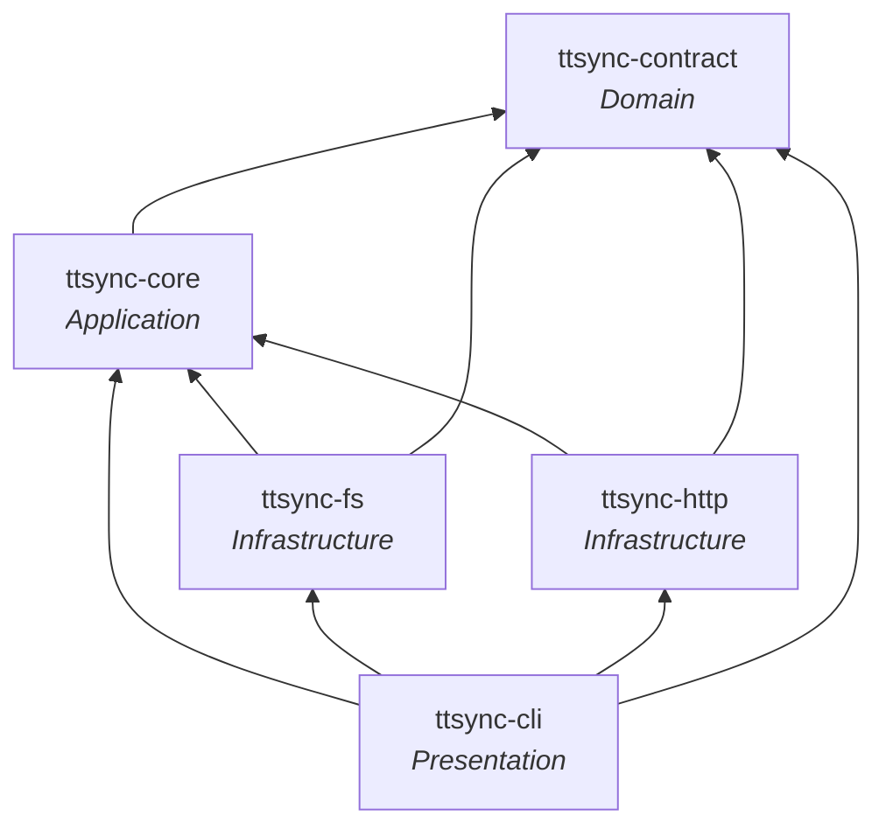
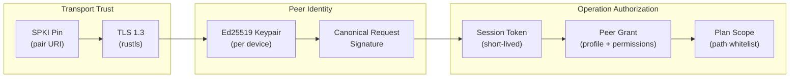
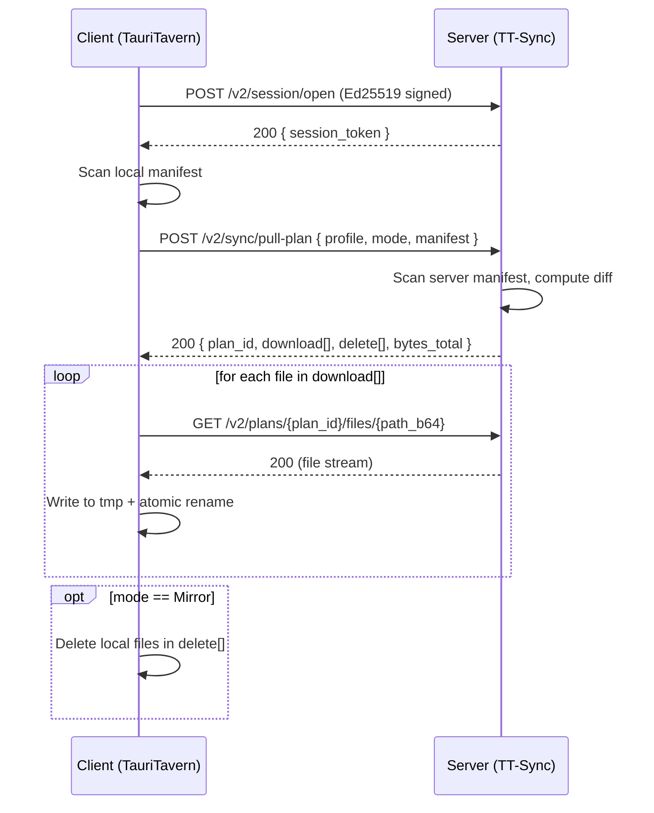
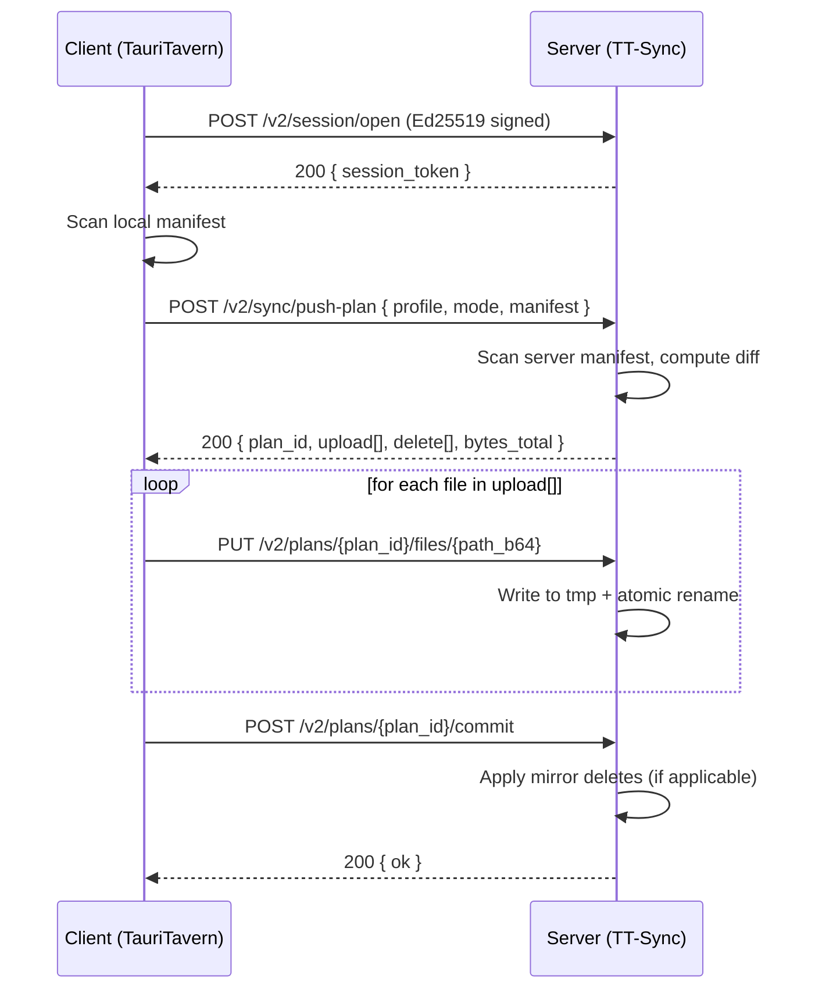

# TT-Sync — System Architecture

## 1. Architectural Style

TT-Sync follows **Clean Architecture** with an explicit dependency rule: inner layers define abstractions, outer layers provide implementations. No inner layer knows about any outer layer.

```
┌──────────────────────────────────────────────────────────┐
│                     ttsync-cli                           │  Presentation
│              (clap commands, progress UI)                │
├──────────────────────────┬───────────────────────────────┤
│       ttsync-http        │        ttsync-fs              │  Infrastructure
│  (axum server, reqwest   │  (manifest scanner,           │  (Adapters)
│   client, TLS setup)     │   atomic file I/O)            │
├──────────────────────────┴───────────────────────────────┤
│                     ttsync-core                          │  Application
│         (use cases, orchestration, traits)               │  (Use Cases)
├──────────────────────────────────────────────────────────┤
│                   ttsync-contract                        │  Domain
│       (protocol types, wire format, invariants)          │  (Entities)
└──────────────────────────────────────────────────────────┘
```

### Dependency Rule



Arrows point toward dependencies. Every crate may depend on layers below it, never above.

## 2. Crate Responsibilities

### 2.1 `ttsync-contract` (Domain Layer)

**Zero business logic. Only types, invariants, and protocol definitions.**

This crate is the shared language between TT-Sync and TauriTavern. It must be usable as a dependency in both projects without pulling in any runtime, framework, or I/O dependency.

#### Key Types

| Type | Purpose |
|------|---------|
| `SyncPath` | Newtype over `String`. Validated at construction: UTF-8, forward-slash separated, no `..`, no leading `/`, no backslash. Once constructed, always valid. |
| `DeviceId` | Newtype `String`. UUID format. |
| `ScopeProfileId` | Enum: `CompatibleMinimal`, `Default`. Exhaustive — forces match-arm updates when profiles are added. |
| `SyncMode` | Enum: `Incremental`, `Mirror`. |
| `ManifestEntryV2` | `{ path: SyncPath, size_bytes: u64, modified_ms: u64, content_hash: Option<String> }` |
| `ManifestV2` | `{ entries: Vec<ManifestEntryV2> }` |
| `PlanId` | Newtype `String`. Server-generated, opaque to clients. |
| `SessionToken` | Newtype `String`. Short-lived bearer token. |
| `PeerGrant` | `{ device_id: DeviceId, device_name: String, public_key: Vec<u8>, profile: ScopeProfileId, permissions: Permissions, paired_at_ms: u64 }` |
| `Permissions` | `{ read: bool, write: bool, mirror_delete: bool }` |
| `SyncPhase` | Enum: `Scanning`, `Diffing`, `Downloading`, `Uploading`, `Deleting`. |
| `PairUri` | Structured pair URI builder/parser: `tauritavern://tt-sync/pair?v=2&url=...&token=...&exp=...&spki=...` |
| `CanonicalRequest` | Builder for the v2 canonical signature format. |

#### Design Rules

- All constructors enforce invariants. Invalid states are unrepresentable.
- `serde::Serialize` + `Deserialize` for wire compatibility.
- No `tokio`, no `std::fs`, no I/O. Only `serde`, `base64`, `thiserror`.

### 2.2 `ttsync-core` (Application Layer)

**Use-case orchestration. Defines traits for all external dependencies.**

This crate contains the "what" of sync operations. It knows the sequence of steps (scan → diff → transfer → commit) but does not know how to scan a filesystem, send an HTTP request, or display a progress bar.

#### Traits (Ports)

```rust
/// Receives sync lifecycle events. Implemented by CLI (progress bar),
/// Tauri adapter (emit events), or test harness (collect assertions).
pub trait SyncEventSink: Send + Sync {
    fn on_progress(&self, event: SyncProgressEvent);
    fn on_completed(&self, event: SyncCompletedEvent);
    fn on_error(&self, event: SyncErrorEvent);
}

/// Reads and writes the file manifest for a data root.
pub trait ManifestStore: Send + Sync {
    async fn scan(&self, profile: &ScopeProfileId) -> Result<ManifestV2, SyncError>;
    async fn read_file(&self, path: &SyncPath) -> Result<Box<dyn AsyncRead + Send>, SyncError>;
    async fn write_file(&self, path: &SyncPath, data: &mut (dyn AsyncRead + Send + Unpin), modified_ms: u64) -> Result<(), SyncError>;
    async fn delete_file(&self, path: &SyncPath) -> Result<(), SyncError>;
}

/// Manages paired peer grants and sessions.
pub trait PeerStore: Send + Sync {
    async fn get_peer(&self, device_id: &DeviceId) -> Result<PeerGrant, SyncError>;
    async fn save_peer(&self, grant: PeerGrant) -> Result<(), SyncError>;
    async fn remove_peer(&self, device_id: &DeviceId) -> Result<(), SyncError>;
    async fn list_peers(&self) -> Result<Vec<PeerGrant>, SyncError>;
}
```

#### Use-Case Modules

| Module | Responsibility |
|--------|---------------|
| `pairing` | Generate pairing tokens, validate incoming pair requests, register peer grants. |
| `session` | Open/validate sessions: verify Ed25519 signatures, enforce time window, track nonces. |
| `plan` | Compute pull-plan and push-plan diffs given source and target manifests. |
| `pull` | Orchestrate pull: request plan → download files → optional mirror delete → emit events. |
| `push` | Orchestrate push: request plan → upload files → commit → emit events. |
| `scope` | Profile definitions: which paths are included/excluded for each `ScopeProfileId`. |

#### Error Type

```rust
pub enum SyncError {
    NotFound(String),
    InvalidData(String),
    Unauthorized(String),
    Io(String),
    Internal(String),
}
```

Intentionally simple. Maps cleanly to HTTP status codes at the adapter boundary.

### 2.3 `ttsync-fs` (Infrastructure — File System Adapter)

**Implements `ManifestStore` against the real file system.**

| Component | Responsibility |
|-----------|---------------|
| `FsManifestStore` | Walks data root directories per scope profile. Produces `ManifestV2`. |
| Profile path tables | Static definitions of included directories/files and excluded paths per `ScopeProfileId`. |
| Atomic write | Write to `{name}.{ext}.ttsync.tmp` → `rename` to final path. Same pattern as current LAN Sync. |
| mtime preservation | Uses `filetime` to set modification time after write. |
| Path mapping | Translates `SyncPath` (wire format, always `/`-separated) to platform-native `PathBuf`. |
| Root kind handling | Supports `data-root` (ST-compatible) and `user-root` layouts. Path prefix mapping stays inside this adapter — never leaks to wire protocol. |

### 2.4 `ttsync-http` (Infrastructure — HTTP Adapter)

**Implements the v2 HTTP protocol: server routes (axum) and client calls (reqwest).**

#### Server (`server` module)

Routes:

| Method | Path | Purpose |
|--------|------|---------|
| `GET` | `/v2/status` | Health check. Returns server identity and capabilities. |
| `POST` | `/v2/pair/complete` | Consume one-time token, register peer. |
| `POST` | `/v2/session/open` | Ed25519-signed session open. Returns `SessionToken`. |
| `POST` | `/v2/sync/pull-plan` | Compute pull diff. Returns `PlanId` + file list. |
| `POST` | `/v2/sync/push-plan` | Compute push diff. Returns `PlanId` + file list. |
| `GET` | `/v2/plans/{plan_id}/files/{path_b64}` | Download file (plan-scoped). |
| `PUT` | `/v2/plans/{plan_id}/files/{path_b64}` | Upload file (plan-scoped). |
| `POST` | `/v2/plans/{plan_id}/commit` | Finalize push: apply deletions. |

Shared middleware:
- **Session auth extractor** — validates `SessionToken` from `Authorization: Bearer` header.
- **Plan-scope guard** — ensures requested path exists in the active plan.

#### TLS (`tls` module)

| Component | Responsibility |
|-----------|---------------|
| `SelfManagedTls` | Loads or generates long-term TLS private key + self-signed cert via `rcgen`. Computes `spki_sha256`. Configures `rustls::ServerConfig`. |
| `TlsMode` trait | Abstraction point for future `ProvidedCert` / `BehindProxy` modes. MVP only implements `SelfManagedTls`. |

#### Client (`client` module)

| Component | Responsibility |
|-----------|---------------|
| `SyncClient` | High-level client: open session, request plan, download/upload files, commit. Uses `reqwest`. |
| SPKI pinning verifier | Custom `ServerCertVerifier` that validates the server's SPKI hash against the pinned value from pairing, ignoring hostname/issuer/expiry. |

### 2.5 `ttsync-cli` (Presentation Layer)

**Thin shell. No business logic.**

| Subcommand | Delegates to |
|------------|-------------|
| `init` | Interactive prompts → writes `config.toml` via core/fs. Generates crypto identity. |
| `serve` | Configures TLS → starts axum server → prints startup banner → blocks. |
| `pair open` | Generates token via core → prints pair URI / QR / permissions. |
| `peers list` | Reads peer store → formats table. |
| `peers revoke` | Removes peer via core. |
| `profile list` | Lists built-in profiles with included/excluded paths. |
| `doctor` | Validates config, TLS cert, data root access. |
| `cert show` | Displays SPKI fingerprint, cert expiry, key info. |
| `cert rotate-leaf` | Re-signs cert with same key (preserves SPKI pin). |

Implements `SyncEventSink` → maps events to `indicatif` progress bars and `tracing` log lines.

## 3. Security Architecture



### Layer Responsibilities

| Layer | Protects Against | Mechanism |
|-------|-----------------|-----------|
| **Transport Trust** | Eavesdropping, MITM, server impersonation | TLS 1.3 with SPKI pinning (no reliance on hostname or CA chain) |
| **Peer Identity** | Unauthorized devices | Ed25519 signature on session-open request (device_id + timestamp + nonce) |
| **Operation Authorization** | Privilege escalation, unauthorized file access | Session token scoped to peer grant; file access restricted to active plan paths |

### Canonical Request Format (v2)

```
TT-SYNC-V2
<device-id>
<timestamp-ms>
<nonce>
<method>
<path-and-query>
<body-sha256-base64url>
```

Signed with the device's Ed25519 private key. Server verifies against the registered public key, enforces ±90s time window, and maintains an LRU nonce set for replay prevention.

## 4. Data Flow

### Pull Sequence



### Push Sequence



## 5. State Management

### Server State Directory

```
<state-dir>/
├── config.toml           # User-editable configuration
├── identity.json         # Ed25519 keypair + device_id
├── tls/
│   ├── key.pem           # Long-term TLS private key
│   └── cert.pem          # Self-signed leaf certificate
├── peers.json            # Registered peer grants
└── sessions/             # Active session tokens (in-memory only, not persisted)
```

The state directory is **never** inside the synced data tree. This eliminates the need for recursive exclusion rules and prevents accidental synchronization of cryptographic material.

### Wire Path Convention

All paths on the wire use data-root-relative notation with forward slashes:
- `default-user/characters/Alice/Alice.json`
- `extensions/third-party/my-ext/index.js`
- `_tauritavern/extension-sources/local/ext.json`

Layout adaptation (e.g., mapping `user-root` to `default-user/...`) is an `ttsync-fs` concern, never exposed on the wire.

## 6. Extension Points (Post-MVP)

| Extension | Where It Plugs In |
|-----------|------------------|
| `provided-cert` TLS mode | `TlsMode` trait in `ttsync-http` |
| `behind-proxy` TLS mode | `TlsMode` trait in `ttsync-http` |
| Custom scope overlays (include/exclude rules) | `scope` module in `ttsync-core` |
| BLAKE3 content verification | `ManifestEntryV2.content_hash` field + scanner option in `ttsync-fs` |
| TauriTavern Tauri adapter | Implements `SyncEventSink` → emits `lan_sync:*` Tauri events |
| WebSocket/SSE notifications | Additional routes in `ttsync-http` server |
