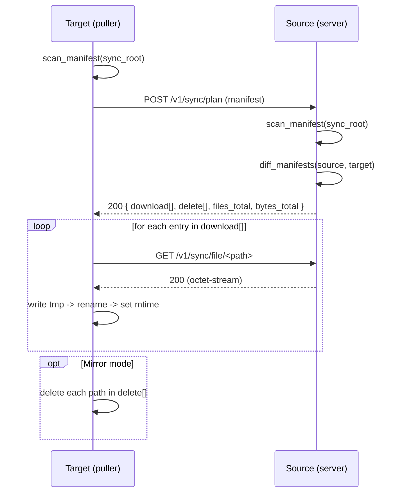

# TauriTavern LAN Sync — Upstream Contract (v1 snapshot, 2026-03-22)

This document describes the **actual, shipped behavior** of TauriTavern’s built-in **LAN Sync (v1)** feature, end-to-end (frontend → Tauri commands/events → backend services → HTTP protocol → filesystem).

It exists to prevent TT-Sync development from drifting away from upstream semantics when we:

- keep a **compatibility mode** (scope + behavior),
- implement a **TauriTavern adapter** for TT-Sync v2, or
- debug interoperability issues.

> TT-Sync v2 is a new protocol and architecture. This document is still valuable because “what users mean by sync” is defined by upstream LAN Sync behavior (scope, mirror semantics, timestamps, etc.), not by a particular transport.

---

## 0. Sources of Truth (upstream code)

When this contract needs updating, these files are the authoritative reference:

- Backend (Rust):
  - `src-tauri/src/infrastructure/lan_sync/paths.rs` (sync scope + path validation)
  - `src-tauri/src/infrastructure/lan_sync/manifest.rs` (manifest scan + diff)
  - `src-tauri/src/infrastructure/lan_sync/crypto.rs` (HMAC canonical/signature)
  - `src-tauri/src/infrastructure/lan_sync/server.rs` (HTTP server routes)
  - `src-tauri/src/infrastructure/lan_sync/client.rs` (download/apply algorithm)
  - `src-tauri/src/infrastructure/lan_sync/store.rs` + `runtime.rs` (state, caches, events)
  - `src-tauri/src/application/services/lan_sync_service.rs` (pair URI, orchestrations)
  - `src-tauri/src/presentation/commands/lan_sync_commands.rs` (Tauri commands + DTOs)
- Frontend (JS):
  - `src/scripts/tauri/setting/setting-panel.js` (UI usage of commands + events)

---

## 1. Mental Model / Terminology

LAN Sync is **P2P over local network**:

- Each device can run an **HTTP server** (Axum) and can act as:
  - **Source**: serves `/v1/sync/plan` and `/v1/sync/file/...`
  - **Target**: pulls from a source and writes data into its local data root
- Pairing establishes a long-term **shared secret** (`pair_secret`) used to authenticate requests.

Important: v1 “push” is not a data upload. It is **“notify peer to pull from me”**.

---

## 2. Data Roots & On-Disk State

### 2.1 Sync root vs store root

At bootstrap time, TauriTavern constructs LAN Sync with:

- `sync_root` = the **data root directory** (contains `default-user/`, `extensions/`, `_tauritavern/`, ...)
- `store_root` = `default-user/` directory

All wire paths are **relative to `sync_root`**.

### 2.2 LAN Sync state directory (must never be synced)

LAN Sync persists its own state under:

```
<sync_root>/default-user/user/lan-sync/
  config.json
  identity.json
  paired-devices.json
```

This path is explicitly excluded from sync scope (see §3).

### 2.3 State file formats

`config.json`:

```json
{ "port": 54321, "sync_mode": "Incremental" }
```

- `port`: chosen once (random in `49152..=65535`) and persisted.
- `sync_mode`: `"Incremental"` (default) or `"Mirror"`.

`identity.json`:

```json
{ "device_id": "uuid-v4-string", "device_name": "TauriTavern" }
```

`paired-devices.json` (array):

```json
[
  {
    "device_id": "peer-uuid",
    "device_name": "Peer Name",
    "pair_secret": "base64url(hmac_sha256(...))",
    "last_known_address": "http://192.168.1.10:54321",
    "paired_at_ms": 1710000000000,
    "last_sync_ms": 1710000123456
  }
]
```

Notes:

- `pair_secret` is stored **in plaintext** on disk (it is the auth material for v1).
- `last_known_address` may be `null` (UI will ask users to reconnect).

---

## 3. Sync Scope (the “what” of sync)

### 3.1 Allowed scope roots

**Directories (recursive):**

```
default-user/chats
default-user/characters
default-user/groups
default-user/group chats
default-user/worlds
default-user/themes
default-user/user
default-user/User Avatars
default-user/OpenAI Settings
default-user/extensions
extensions/third-party
_tauritavern/extension-sources/local
_tauritavern/extension-sources/global
```

**Files (single files):**

```
default-user/settings.json
```

### 3.2 Exclusions (must not appear in manifest)

The following relative path is excluded (and everything under it):

```
default-user/user/lan-sync
```

### 3.3 Wire path rules (validation)

All wire paths are normalized and validated with these rules:

- Non-empty UTF-8 string
- Must **not** start with `/`
- Must **not** contain `\` (always `/` separators)
- No empty segments, `.` or `..`
- Must be either:
  - exactly one of the scoped files, or
  - under one of the scoped directories (`<root>/...`)
- Must not be excluded (`default-user/user/lan-sync/...`)

### 3.4 Symlinks are rejected

Manifest scanning fails if a symlink is encountered anywhere under the scoped roots.

Implication: v1 treats symlinks as an **invalid data** error, not “skip and continue”.

---

## 4. Frontend ↔ Backend (Tauri) Contract

### 4.1 Events (names + payloads)

Frontend listens to these event names exactly:

- `lan_sync:pair_request`
  - Payload:
    ```json
    {
      "request_id": "uuid",
      "peer_device_id": "uuid",
      "peer_device_name": "string",
      "peer_ip": "string"
    }
    ```
- `lan_sync:progress`
  - Payload:
    ```json
    {
      "phase": "Scanning|Diffing|Downloading|Deleting",
      "files_done": 0,
      "files_total": 0,
      "bytes_done": 0,
      "bytes_total": 0,
      "current_path": "relative/path" | null
    }
    ```
- `lan_sync:completed`
  - Payload:
    ```json
    { "files_total": 0, "bytes_total": 0, "files_deleted": 0 }
    ```
- `lan_sync:error`
  - Payload:
    ```json
    { "message": "string" }
    ```

Frontend behavior to be aware of:

- On `lan_sync:completed`, the UI shows a summary popup and then does `window.location.reload()`.
- On `lan_sync:error`, the UI shows an error popup (no reload).

### 4.2 Commands (invoke names + semantics)

Frontend uses these commands:

- `lan_sync_get_status() -> LanSyncStatus`
- `lan_sync_start_server() -> LanSyncStatus`
- `lan_sync_stop_server() -> ()`
- `lan_sync_enable_pairing({ address?: string }) -> PairingInfoDto`
- `lan_sync_get_pairing_info({ address: string }) -> PairingInfoDto`
- `lan_sync_request_pairing({ pairUri: string }) -> PairedDeviceDto`
- `lan_sync_confirm_pairing({ requestId: string, accept: bool }) -> ()`
- `lan_sync_list_devices() -> PairedDeviceDto[]`
- `lan_sync_remove_device({ deviceId: string }) -> ()`
- `lan_sync_sync_from_device({ deviceId: string }) -> ()` (runs async; results via events)
- `lan_sync_push_to_device({ deviceId: string }) -> ()` (notify peer to pull)
- `lan_sync_set_sync_mode({ mode: "Incremental"|"Mirror", persist: bool }) -> ()`
- `lan_sync_clear_sync_mode_override() -> ()`

DTO shapes returned to JS:

`LanSyncStatus`:

```json
{
  "running": true,
  "address": "http://192.168.1.10:54321" | null,
  "available_addresses": ["http://192.168.1.10:54321"],
  "port": 54321,
  "pairing_enabled": true,
  "pairing_expires_at_ms": 1710000000000 | null,
  "sync_mode": "Incremental|Mirror",
  "sync_mode_persistent": "Incremental|Mirror",
  "sync_mode_overridden": true
}
```

`PairingInfoDto`:

```json
{
  "address": "http://192.168.1.10:54321",
  "pair_uri": "tauritavern://lan-sync/pair?...",
  "qr_svg": "<svg>...</svg>",
  "expires_at_ms": 1710000000000
}
```

`PairedDeviceDto`:

```json
{
  "device_id": "uuid",
  "device_name": "string",
  "last_known_address": "http://..." | null,
  "paired_at_ms": 1710000000000,
  "last_sync_ms": 1710000123456 | null
}
```

---

## 5. Pairing (v1)

### 5.0 Server binding and address advertisement

- The LAN Sync server binds to `0.0.0.0:<port>` (IPv4 wildcard).
- `LanSyncStatus.available_addresses` is computed by enumerating local network interfaces and listing **IPv4** non-loopback addresses as `http://<ip>:<port>` (IPv6 is not advertised).
- The address embedded in the Pair URI is a *chosen advertise address*:
  - If the UI provides an address, that exact string is used.
  - Otherwise, upstream picks a default based on the OS route IP (if present in the list), falling back to the first available address.

### 5.1 Preconditions and lifetime

- The LAN Sync HTTP server must be running.
- Pairing is enabled for **5 minutes** (`expires_at_ms = now + 5min`).
- Pairing session is held in memory only (lost on app restart).

### 5.2 Pair URI format (rendered by source device)

```
tauritavern://lan-sync/pair?v=1&addr=http://<ip>:<port>&pair_code=<base64url>&exp=<expires_at_ms>
```

Notes:

- The requester only requires `addr` and `pair_code`. `v` and `exp` are not validated during parsing.
- `addr` is a full base URL like `http://192.168.1.10:54321` (no trailing slash required).
- `pair_code` is `random_base64url(16)` (16 random bytes, base64url without padding).
- While a pairing session is active, the source UI can regenerate the Pair URI for a different advertise address **without changing** the `pair_code` (same pairing session, different `addr`).

### 5.3 Pairing request/response

Requester → Source:

`POST {addr}/v1/pair`

- Headers:
  - `X-TT-Signature: <hmac signature using pair_code as key>`
- JSON body:
  ```json
  { "target_device_id": "uuid", "target_device_name": "string", "target_port": 54321 }
  ```

Source → Requester:

- User is prompted via `lan_sync:pair_request` event.
- If accepted: `200 OK` with JSON body:
  ```json
  { "source_device_id": "uuid", "source_device_name": "string" }
  ```
- If rejected: `403 Forbidden` with text body `"Pairing rejected"`.

Upsert semantics:

- Both sides persist the result via an **upsert** keyed by `device_id`.
- Pairing again with the same peer (UI calls this “reconnect”) will overwrite the existing record and effectively **rotate** `pair_secret` (because it is derived from the fresh `pair_code`).

### 5.4 Pair secret derivation (shared secret)

Both sides derive:

```
pair_secret = base64url( HMAC-SHA256(
  key = pair_code,
  msg = "TT-LANSYNC-PAIR-SECRET" || source_device_id || target_device_id
))
```

This `pair_secret` becomes the long-term authentication key for all sync endpoints.

### 5.5 Address book update rules

Upstream stores peer addresses in an asymmetric but practical way:

- Requester stores source’s address as:
  - `last_known_address = addr` from the Pair URI
- Source stores requester’s address as:
  - `last_known_address = "http://{peer_ip}:{target_port}"`
  - where `peer_ip` comes from the TCP connection’s remote IP, and `target_port` is from the request body.

This is why v1 pairing is LAN-oriented: it assumes the peer is reachable at `peer_ip:target_port`.

---

## 6. v1 Request Authentication (HMAC canonical signature)

### 6.1 Headers

All authenticated endpoints require:

- `X-TT-Device-Id: <device uuid>` (the caller’s identity)
- `X-TT-Signature: <signature>`

Exception:

- `/v1/pair` requires only `X-TT-Signature` (because device id is inside the request body).

### 6.2 Canonical form

For a request with:

- `method` (e.g. `GET`, `POST`)
- `path` (e.g. `/v1/sync/plan`)
- `body` bytes (raw bytes, not “parsed JSON”)

Upstream computes:

```
canonical = UPPER(method) + "\n" + path + "\n" + base64url(sha256(body))
signature = base64url( HMAC-SHA256(key, canonical) )
```

Important interoperability details:

- The canonical `path` is **the decoded path** (e.g. it contains spaces as literal spaces, not `%20`).
- For JSON requests, the body bytes must match the sender’s serialization exactly.
- The host, scheme, and port are not signed.

---

## 7. Sync Protocol (HTTP v1)

### 7.1 Endpoints

Server provides:

- `GET /v1/status` → `200 {"ok": true}`
- `POST /v1/sync/plan` (auth) → `200 LanSyncDiffPlan`
- `GET /v1/sync/file/*path` (auth) → `200` streaming bytes
- `POST /v1/sync/pull` (auth) → `202 {"ok": true}` and starts a pull task

### 7.2 Pull sync: actual file transfer

Pull is always “target downloads from source”.

Sequence (high level):



### 7.3 Plan computation (diff semantics)

Given:

- `source_manifest`: scanned on source device
- `target_manifest`: scanned on target device

Upstream plan is:

- `download`: all source entries where target does not have an entry with the same:
  - `relative_path`, **and**
  - `size_bytes`, **and**
  - `modified_ms`
- `delete`: all target entries whose `relative_path` does not exist in source
- `files_total = download.len()`
- `bytes_total = sum(download.size_bytes)`

This is a **mtime+size based** incremental strategy (no content hashing).

### 7.4 Download/apply semantics (atomicity + timestamps)

For each planned download entry:

- Create parent directories as needed.
- Download via streaming GET.
- Write into a tmp file:
  - If original has an extension `ext`, tmp filename becomes `*.ext.ttsync.tmp`
  - Else tmp filename becomes `*.ttsync.tmp`
- Commit by `rename(tmp, full_path)`
  - If rename fails with `AlreadyExists` (Windows behavior), upstream deletes the destination and retries rename.
- Set file mtime to `entry.modified_ms` (ms since UNIX epoch).

Concurrency:

- Desktop: 4 parallel downloads
- Android/iOS: 2 parallel downloads

### 7.5 Mirror delete semantics (strict)

If effective sync mode is `"Mirror"`:

- Delete every file in `plan.delete` using `remove_file`.
- Missing/unremovable files are treated as an error (upstream does not ignore `NotFound` here).

If mode is `"Incremental"`:

- `plan.delete` is ignored.

### 7.6 Progress event semantics

Phases:

- `Scanning` (before scanning local manifest)
- `Diffing` (before requesting plan)
- `Downloading` (after receiving plan)
- `Deleting` (only when Mirror mode and there is something to delete)

During `Downloading` and `Deleting`, progress events are emitted when:

- first file completes (`files_done == 1`)
- every 10 files (`files_done % 10 == 0`)
- last file completes (`files_done == files_total`)

### 7.7 Post-sync side effects

After a successful pull:

- Target updates `paired_device.last_sync_ms = now_ms()` and persists it.
- Target calls `AppState.refresh_after_external_data_change("lan_sync")` to clear runtime caches.
- Then target emits `lan_sync:completed`.

If cache refresh fails after transfers, upstream emits `lan_sync:error` even though the filesystem changes were already applied.

### 7.8 “Push” is “notify peer to pull”

When a user clicks “Upload” in the UI, the app sends:

`POST http://peer/v1/sync/pull`

This does not upload data. It instructs the peer to start its own pull (download) from the sender.

Limitations:

- Requires both sides to have correct `last_known_address` records.
- Requires the sender’s server to be running, because the peer will download from it.

---

## 8. Concurrency / Re-entrancy Rule

LAN Sync enforces a global “one sync at a time” rule with a semaphore:

- A manual sync while another sync is running:
  - emits `lan_sync:error` and returns `Ok(())` from the command
- A `/v1/sync/pull` notify while another sync is running:
  - returns `400` (“LAN sync already running”)

---

## 9. Server Error Semantics (HTTP)

Upstream maps errors to status codes as follows:

- `400 Bad Request`: invalid data (including path validation)
- `401 Unauthorized`: missing headers, unknown device, invalid signature, pairing not enabled/expired
- `403 Forbidden`: pairing rejected by user
- `404 Not Found`: missing file or unknown resource
- `429 Too Many Requests`: rate-limited (not currently used by LAN Sync paths)
- `500 Internal Server Error`: internal errors

Common endpoint-specific failures:

- `/v1/pair`:
  - `401 Pairing not enabled`
  - `401 Pairing expired`
  - `401 Missing signature`
  - `401 Invalid signature`
  - `403 Pairing rejected`
- `/v1/sync/plan`:
  - `401 Missing device id / signature`
  - `401 Unknown device`
  - `401 Invalid signature`
  - `400 Path not allowed in sync scope` (if target manifest contains out-of-scope entries)
- `/v1/sync/file/*path`:
  - `400 invalid path`
  - `401 unknown device / invalid signature`
  - `404 file not found`
- `/v1/sync/pull`:
  - `401 unknown device / invalid signature`
  - `400 LAN sync already running`

---

## 10. Implications for TT-Sync (compatibility constraints)

If TT-Sync wants to “feel the same” as upstream LAN Sync (even with a different protocol):

- **Scope parity is non-negotiable** for a compatibility profile:
  - The allowed roots and exclusions in §3 should match exactly.
  - Never sync LAN Sync state material (or any cryptographic material).
- Preserve **wire path semantics**:
  - forward slashes, UTF-8, allow spaces (e.g. `default-user/group chats/...`)
  - strict prevention of traversal (`..`) and excluded roots
- Preserve **mtime semantics**:
  - Upstream incremental diff is based on `(size_bytes, modified_ms)` equality.
  - If TT-Sync uses hashes, it must still preserve mtime on write so TauriTavern doesn’t “churn” unnecessarily.
- Preserve **Mirror vs Incremental** meaning:
  - Mirror may delete; Incremental must not delete.
- Preserve **atomic write behavior**:
  - write-to-tmp, rename, then set mtime.

When protocol surfaces differ (v2 TLS, sessions, upload), treat this document as the definition of:

- “what data is in scope”
- “what mirror means”
- “what progress phases mean”

not necessarily “how the transport is implemented”.
